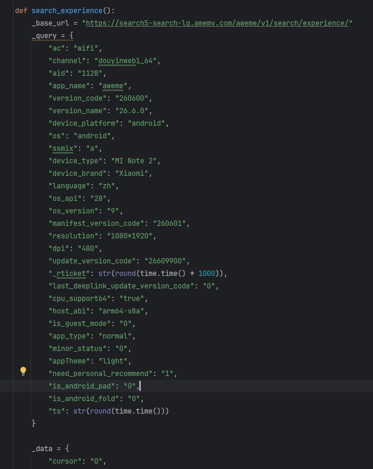
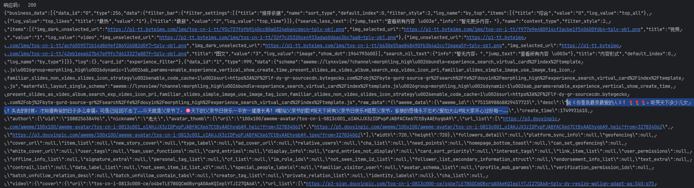

# aweme_api
抖音API

目前还在测试中，计划开发抖音常用功能接口。

如首页搜索的GeneralSearch, VideoSearch, UserSearch, ShoppingSearch, LiveSearch, MusicSearch, ChallengeSearch, ExperienceSearch

如抖音商城中的 Search, Detail

先放一下ExperienceSearch请求代码及请求效果

